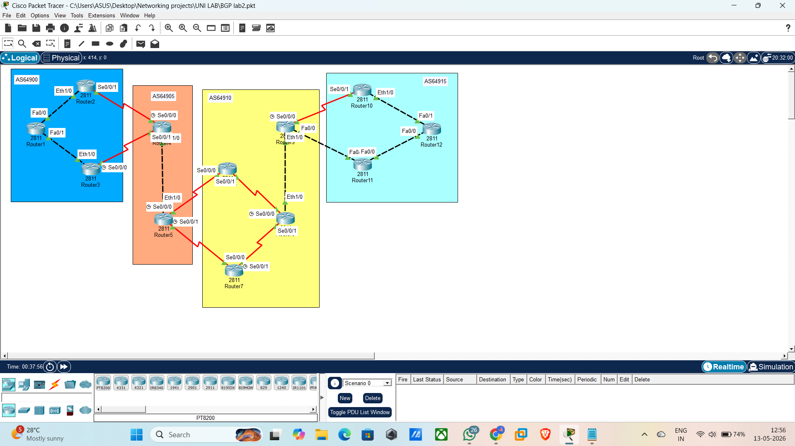
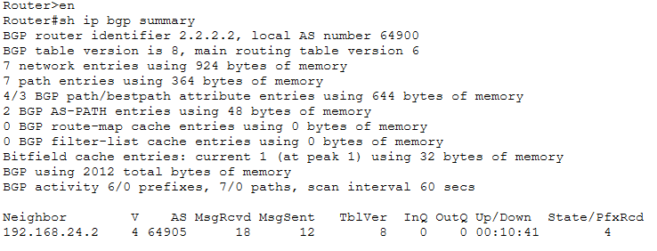
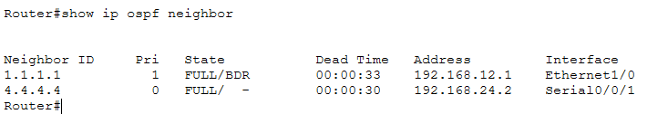
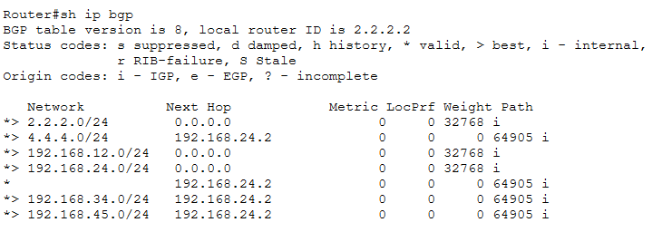
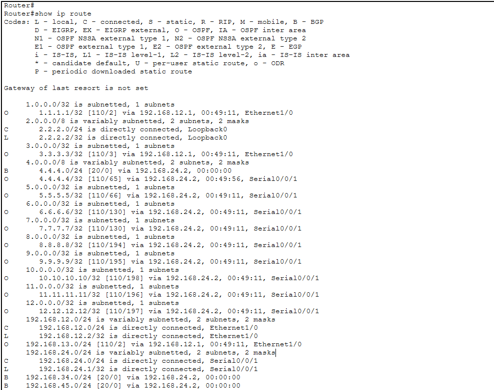
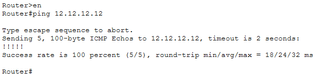

[README (1).md](https://github.com/user-attachments/files/27813030/README.1.md)
# 🌐 Basic BGP Lab — Multi-AS Network Configuration

[](https://github.com/Jay537351/BGP_LAB_Pkt_Tracer)
[](https://github.com/Jay537351/BGP_LAB_Pkt_Tracer)
[](https://github.com/Jay537351/BGP_LAB_Pkt_Tracer)
[](https://github.com/Jay537351/BGP_LAB_Pkt_Tracer/blob/main/LICENSE)

> A hands-on Cisco Packet Tracer lab implementing Border Gateway Protocol (BGP) across 4 Autonomous Systems with 12 routers, including OSPF as the underlying IGP.

---

## 📋 Table of Contents

- [Overview](#overview)
- [Network Topology](#network-topology)
- [Autonomous Systems](#autonomous-systems)
- [IP Addressing Scheme](#ip-addressing-scheme)
- [Prerequisites](#prerequisites)
- [Lab Objectives](#lab-objectives)
- [Configuration Guide](#configuration-guide)
  - [Interface Configuration](#interface-configuration)
  - [Loopback Interfaces](#loopback-interfaces)
  - [OSPF Configuration](#ospf-configuration)
  - [BGP Configuration](#bgp-configuration)
- [Screenshots](#screenshots)
- [BGP Concepts Explained](#bgp-concepts-explained)
- [OSPF Concepts Explained](#ospf-concepts-explained)
- [Packet Tracer Limitations](#packet-tracer-limitations)
- [Verification Commands](#verification-commands)
- [Troubleshooting Guide](#troubleshooting-guide)
- [Key Lessons Learned](#key-lessons-learned)
- [Future Improvements](#future-improvements)

---

## Overview

This lab demonstrates the configuration of **Border Gateway Protocol (BGP)** across multiple Autonomous Systems (AS) using Cisco 2811 routers in Packet Tracer. It covers eBGP (between different AS) combined with OSPF as the Interior Gateway Protocol (IGP) to ensure reachability between BGP next-hops.

**Original lab design by:** Patel Jay (pjay20370@gmail.com)  
**Tool used:** Cisco Packet Tracer  
**Router model:** Cisco 2811 

---

## Network Topology

```
AS64900                AS64905              AS64910                AS64915
┌─────────────┐    ┌──────────┐    ┌──────────────────┐    ┌──────────────┐
│   R2        │    │          │    │   R6      R9     │    │  R10         │
│  /  \       │    │  R4──R5  │    │    \    /   \    │    │    \         │
│ R1   R3     │    │          │    │     R8      R10  │    │     R12      │
│             │    │          │    │    /    \        │    │    /         │
└─────────────┘    └──────────┘    │   R7      R11   │    │  R11         │
                                   └──────────────────┘    └──────────────┘
```



---

## Autonomous Systems

| AS Number | Routers | Role |
|-----------|---------|------|
| **AS64900** | R1, R2, R3 | Origin AS — leftmost network |
| **AS64905** | R4, R5 | Transit AS — middle left |
| **AS64910** | R6, R7, R8, R9 | Transit AS — middle right |
| **AS64915** | R10, R11, R12 | Destination AS — rightmost network |

---

## IP Addressing Scheme

### Point-to-Point Links (192.168.YY.x/24)

| Link | Subnet | Router A IP | Router B IP |
|------|--------|------------|------------|
| R1 — R2 | 192.168.12.0/24 | R1: .1 | R2: .2 |
| R1 — R3 | 192.168.13.0/24 | R1: .1 | R3: .2 |
| R2 — R4 | 192.168.24.0/24 | R2: .1 | R4: .2 |
| R3 — R4 | 192.168.34.0/24 | R3: .1 | R4: .2 |
| R4 — R5 | 192.168.45.0/24 | R4: .1 | R5: .2 |
| R5 — R6 | 192.168.56.0/24 | R5: .1 | R6: .2 |
| R5 — R7 | 192.168.57.0/24 | R5: .1 | R7: .2 |
| R6 — R8 | 192.168.68.0/24 | R6: .1 | R8: .2 |
| R7 — R8 | 192.168.78.0/24 | R7: .1 | R8: .2 |
| R8 — R9 | 192.168.89.0/24 | R8: .1 | R9: .2 |
| R9 — R10 | 192.168.109.0/24 | R9: .1 | R10: .2 |
| R9 — R11 | 192.168.119.0/24 | R9: .1 | R11: .2 |
| R10 — R12 | 192.168.120.0/24 | R10: .1 | R12: .2 |
| R11 — R12 | 192.168.121.0/24 | R11: .1 | R12: .2 |

### Loopback Addresses (Y.Y.Y.Y/24)

| Router | Loopback IP | Router | Loopback IP |
|--------|------------|--------|------------|
| R1 | 1.1.1.1/24 | R7 | 7.7.7.7/24 |
| R2 | 2.2.2.2/24 | R8 | 8.8.8.8/24 |
| R3 | 3.3.3.3/24 | R9 | 9.9.9.9/24 |
| R4 | 4.4.4.4/24 | R10 | 10.10.10.10/24 |
| R5 | 5.5.5.5/24 | R11 | 11.11.11.11/24 |
| R6 | 6.6.6.6/24 | R12 | 12.12.12.12/24 |

---

## Prerequisites

- Cisco Packet Tracer installed (version 7.0 or higher recommended)
- Basic understanding of IP addressing and subnetting
- Familiarity with Cisco IOS CLI
- Understanding of routing concepts

### Router Setup in Packet Tracer

Each router requires additional modules before configuration:

| Module | Purpose | Routers Needing It |
|--------|---------|-------------------|
| **WIC-2T** | Adds 2 serial ports (Se0/0/0, Se0/0/1) | R2, R3, R4, R5, R6, R7, R8, R9, R10 |
| **NM-1E** | Adds Ethernet port (Eth1/0) | R2, R3, R4, R8, R9 |

**To add a module in Packet Tracer:**
1. Click the router
2. Go to the **Physical** tab
3. **Power OFF** the router (click the green power button)
4. Drag the module into an empty slot
5. Power the router back **ON**

> ⚠️ **Important:** Always power off before adding modules or the router will not recognize them.

---

## Lab Objectives

1. Configure and cable Serial/Ethernet interfaces as shown in the topology
2. Assign IP addresses using the 192.168.YY.x/24 scheme
3. Configure loopback interfaces using Y.Y.Y.Y/24 scheme
4. Configure OSPF within each AS for internal reachability
5. Configure eBGP between border routers of different AS
6. Verify end-to-end connectivity from R1 to R12

---

## Configuration Guide

### Interface Configuration

<details>
<summary>Click to expand — Router 1</summary>

```cisco
en
conf t
hostname R1
interface fa0/0
 ip address 192.168.12.1 255.255.255.0
 no shutdown
interface fa0/1
 ip address 192.168.13.1 255.255.255.0
 no shutdown
interface loopback 0
 ip address 1.1.1.1 255.255.255.0
```
</details>

<details>
<summary>Click to expand — Router 2</summary>

```cisco
en
conf t
hostname R2
interface eth1/0
 ip address 192.168.12.2 255.255.255.0
 no shutdown
interface se0/0/1
 ip address 192.168.24.1 255.255.255.0
 no shutdown
interface loopback 0
 ip address 2.2.2.2 255.255.255.0
```
</details>

<details>
<summary>Click to expand — Router 3</summary>

```cisco
en
conf t
hostname R3
interface eth1/0
 ip address 192.168.13.2 255.255.255.0
 no shutdown
interface se0/0/0
 clock rate 64000
 ip address 192.168.34.1 255.255.255.0
 no shutdown
interface loopback 0
 ip address 3.3.3.3 255.255.255.0
```
</details>

<details>
<summary>Click to expand — Routers 4 through 12</summary>

```cisco
! R4
en
conf t
hostname R4
interface se0/0/0
 clock rate 64000
 ip address 192.168.24.2 255.255.255.0
 no shutdown
interface se0/0/1
 ip address 192.168.34.2 255.255.255.0
 no shutdown
interface eth1/0
 ip address 192.168.45.1 255.255.255.0
 no shutdown
interface loopback 0
 ip address 4.4.4.4 255.255.255.0

! R5
en
conf t
hostname R5
interface eth1/0
 ip address 192.168.45.2 255.255.255.0
 no shutdown
interface se0/0/0
 clock rate 64000
 ip address 192.168.56.1 255.255.255.0
 no shutdown
interface se0/0/1
 clock rate 64000
 ip address 192.168.57.1 255.255.255.0
 no shutdown
interface loopback 0
 ip address 5.5.5.5 255.255.255.0

! R6
en
conf t
hostname R6
interface se0/0/0
 ip address 192.168.56.2 255.255.255.0
 no shutdown
interface se0/0/1
 ip address 192.168.68.1 255.255.255.0
 no shutdown
interface loopback 0
 ip address 6.6.6.6 255.255.255.0

! R7
en
conf t
hostname R7
interface se0/0/0
 ip address 192.168.57.2 255.255.255.0
 no shutdown
interface se0/0/1
 clock rate 64000
 ip address 192.168.78.1 255.255.255.0
 no shutdown
interface loopback 0
 ip address 7.7.7.7 255.255.255.0

! R8
en
conf t
hostname R8
interface se0/0/0
 clock rate 64000
 ip address 192.168.68.2 255.255.255.0
 no shutdown
interface se0/0/1
 ip address 192.168.78.2 255.255.255.0
 no shutdown
interface eth1/0
 ip address 192.168.89.1 255.255.255.0
 no shutdown
interface loopback 0
 ip address 8.8.8.8 255.255.255.0

! R9
en
conf t
hostname R9
interface eth1/0
 ip address 192.168.89.2 255.255.255.0
 no shutdown
interface se0/0/0
 clock rate 64000
 ip address 192.168.109.1 255.255.255.0
 no shutdown
interface fa0/0
 ip address 192.168.119.1 255.255.255.0
 no shutdown
interface loopback 0
 ip address 9.9.9.9 255.255.255.0

! R10
en
conf t
hostname R10
interface se0/0/1
 ip address 192.168.109.2 255.255.255.0
 no shutdown
interface eth1/0
 ip address 192.168.120.1 255.255.255.0
 no shutdown
interface loopback 0
 ip address 10.10.10.10 255.255.255.0

! R11
en
conf t
hostname R11
interface fa0/1
 ip address 192.168.119.2 255.255.255.0
 no shutdown
interface fa0/0
 ip address 192.168.121.1 255.255.255.0
 no shutdown
interface loopback 0
 ip address 11.11.11.11 255.255.255.0

! R12
en
conf t
hostname R12
interface fa0/1
 ip address 192.168.120.2 255.255.255.0
 no shutdown
interface fa0/0
 ip address 192.168.121.2 255.255.255.0
 no shutdown
interface loopback 0
 ip address 12.12.12.12 255.255.255.0
```
</details>

---

### OSPF Configuration

OSPF provides the underlying path knowledge BGP needs to forward packets.

> ⚠️ **Critical:** OSPF runs **within each AS only**. Do not configure OSPF across AS boundaries.

<details>
<summary>Click to expand — OSPF on all routers</summary>

```cisco
! R1 — AS64900
router ospf 1
 network 192.168.12.0 0.0.0.255 area 0
 network 192.168.13.0 0.0.0.255 area 0
 network 1.1.1.0 0.0.0.255 area 0

! R2 — AS64900
router ospf 1
 network 192.168.12.0 0.0.0.255 area 0
 network 192.168.24.0 0.0.0.255 area 0
 network 2.2.2.0 0.0.0.255 area 0

! R3 — AS64900
router ospf 1
 network 192.168.13.0 0.0.0.255 area 0
 network 192.168.34.0 0.0.0.255 area 0
 network 3.3.3.0 0.0.0.255 area 0

! R4 — AS64905
router ospf 1
 network 192.168.24.0 0.0.0.255 area 0
 network 192.168.34.0 0.0.0.255 area 0
 network 192.168.45.0 0.0.0.255 area 0
 network 4.4.4.0 0.0.0.255 area 0

! R5 — AS64905
router ospf 1
 network 192.168.45.0 0.0.0.255 area 0
 network 192.168.56.0 0.0.0.255 area 0
 network 192.168.57.0 0.0.0.255 area 0
 network 5.5.5.0 0.0.0.255 area 0

! R6 — AS64910
router ospf 1
 network 192.168.56.0 0.0.0.255 area 0
 network 192.168.68.0 0.0.0.255 area 0
 network 6.6.6.0 0.0.0.255 area 0

! R7 — AS64910
router ospf 1
 network 192.168.57.0 0.0.0.255 area 0
 network 192.168.78.0 0.0.0.255 area 0
 network 7.7.7.0 0.0.0.255 area 0

! R8 — AS64910
router ospf 1
 network 192.168.68.0 0.0.0.255 area 0
 network 192.168.78.0 0.0.0.255 area 0
 network 192.168.89.0 0.0.0.255 area 0
 network 8.8.8.0 0.0.0.255 area 0

! R9 — AS64910
router ospf 1
 network 192.168.89.0 0.0.0.255 area 0
 network 192.168.109.0 0.0.0.255 area 0
 network 192.168.119.0 0.0.0.255 area 0
 network 9.9.9.0 0.0.0.255 area 0

! R10 — AS64915
router ospf 1
 network 192.168.109.0 0.0.0.255 area 0
 network 192.168.120.0 0.0.0.255 area 0
 network 10.10.10.0 0.0.0.255 area 0

! R11 — AS64915
router ospf 1
 network 192.168.119.0 0.0.0.255 area 0
 network 192.168.121.0 0.0.0.255 area 0
 network 11.11.11.0 0.0.0.255 area 0

! R12 — AS64915
router ospf 1
 network 192.168.120.0 0.0.0.255 area 0
 network 192.168.121.0 0.0.0.255 area 0
 network 12.12.12.0 0.0.0.255 area 0
```
</details>

---

### BGP Configuration

> ⚠️ **Packet Tracer Limitation:** This version of Cisco Packet Tracer does **not support iBGP**. Only eBGP between different Autonomous Systems is configured. OSPF handles all internal AS routing. For full iBGP support use GNS3 or EVE-NG.

#### eBGP Neighbor Design

| Router | AS | eBGP Neighbor | Neighbor AS |
|--------|----|--------------|-------------|
| R2 | 64900 | R4 — 192.168.24.2 | 64905 |
| R3 | 64900 | R4 — 192.168.34.2 | 64905 |
| R4 | 64905 | R2 — 192.168.24.1 | 64900 |
| R4 | 64905 | R3 — 192.168.34.1 | 64900 |
| R5 | 64905 | R6 — 192.168.56.2 | 64910 |
| R5 | 64905 | R7 — 192.168.57.2 | 64910 |
| R6 | 64910 | R5 — 192.168.56.1 | 64905 |
| R7 | 64910 | R5 — 192.168.57.1 | 64905 |
| R9 | 64910 | R10 — 192.168.109.2 | 64915 |
| R9 | 64910 | R11 — 192.168.119.2 | 64915 |
| R10 | 64915 | R9 — 192.168.109.1 | 64910 |
| R11 | 64915 | R9 — 192.168.119.1 | 64910 |

<details>
<summary>Click to expand — Full BGP configuration</summary>

```cisco
! R1 — No BGP needed, OSPF handles internal routing
! R8 — No BGP needed, OSPF handles internal routing
! R12 — No BGP needed, OSPF handles internal routing

! R2
router bgp 64900
 bgp router-id 2.2.2.2
 neighbor 192.168.24.2 remote-as 64905
 network 192.168.12.0 mask 255.255.255.0
 network 192.168.24.0 mask 255.255.255.0
 network 2.2.2.0 mask 255.255.255.0

! R3
router bgp 64900
 bgp router-id 3.3.3.3
 neighbor 192.168.34.2 remote-as 64905
 network 192.168.13.0 mask 255.255.255.0
 network 192.168.34.0 mask 255.255.255.0
 network 3.3.3.0 mask 255.255.255.0

! R4
router bgp 64905
 bgp router-id 4.4.4.4
 neighbor 192.168.24.1 remote-as 64900
 neighbor 192.168.34.1 remote-as 64900
 network 192.168.24.0 mask 255.255.255.0
 network 192.168.34.0 mask 255.255.255.0
 network 192.168.45.0 mask 255.255.255.0
 network 4.4.4.0 mask 255.255.255.0

! R5
router bgp 64905
 bgp router-id 5.5.5.5
 neighbor 192.168.56.2 remote-as 64910
 neighbor 192.168.57.2 remote-as 64910
 network 192.168.45.0 mask 255.255.255.0
 network 192.168.56.0 mask 255.255.255.0
 network 192.168.57.0 mask 255.255.255.0
 network 5.5.5.0 mask 255.255.255.0

! R6
router bgp 64910
 bgp router-id 6.6.6.6
 neighbor 192.168.56.1 remote-as 64905
 network 192.168.56.0 mask 255.255.255.0
 network 192.168.68.0 mask 255.255.255.0
 network 6.6.6.0 mask 255.255.255.0

! R7
router bgp 64910
 bgp router-id 7.7.7.7
 neighbor 192.168.57.1 remote-as 64905
 network 192.168.57.0 mask 255.255.255.0
 network 192.168.78.0 mask 255.255.255.0
 network 7.7.7.0 mask 255.255.255.0

! R9
router bgp 64910
 bgp router-id 9.9.9.9
 neighbor 192.168.109.2 remote-as 64915
 neighbor 192.168.119.2 remote-as 64915
 network 192.168.89.0 mask 255.255.255.0
 network 192.168.109.0 mask 255.255.255.0
 network 192.168.119.0 mask 255.255.255.0
 network 9.9.9.0 mask 255.255.255.0

! R10
router bgp 64915
 bgp router-id 10.10.10.10
 neighbor 192.168.109.1 remote-as 64910
 network 192.168.109.0 mask 255.255.255.0
 network 192.168.120.0 mask 255.255.255.0
 network 10.10.10.0 mask 255.255.255.0

! R11
router bgp 64915
 bgp router-id 11.11.11.11
 neighbor 192.168.119.1 remote-as 64910
 network 192.168.119.0 mask 255.255.255.0
 network 192.168.121.0 mask 255.255.255.0
 network 11.11.11.0 mask 255.255.255.0
```
</details>

---

## Screenshots

### Full Network Topology


### BGP Neighbors Summary — R2


### OSPF Neighbors — R2


### BGP Routing Table — R2


### Full Routing Table — R2


### Successful End-to-End Ping — R1 to R12


---

## BGP Concepts Explained

### What is BGP?
Border Gateway Protocol (BGP) is the routing protocol that powers the internet. It connects different organizations and ISPs together by exchanging routing information between Autonomous Systems.

### eBGP vs iBGP

| Feature | iBGP | eBGP |
|---------|------|------|
| Scope | Within same AS | Between different AS |
| AS numbers | Same on both sides | Different on each side |
| TTL | 255 (can be far apart) | 1 (must be directly connected) |
| Route forwarding | Does NOT forward to other iBGP peers | Freely forwards to all neighbors |
| Real-world example | Routers inside one ISP | Two different ISPs connecting |

### Autonomous System (AS)
A collection of IP networks under a single administrative domain sharing a common routing policy. Each AS has a unique AS number (ASN).

### BGP Router ID
A unique 32-bit identifier for each BGP router, typically set to the loopback IP address for stability.

### Loopback Interfaces
Virtual interfaces that never go down as long as the router is powered on. Used as stable BGP router IDs and peering addresses.

### The `network` Command
Tells BGP which prefixes to advertise to neighbors. The prefix must already exist in the routing table or BGP will ignore it.

---

## OSPF Concepts Explained

### Why OSPF is Needed Alongside BGP
BGP knows **what** destinations exist but needs OSPF to know **how** to physically reach the next hop router. Without OSPF, BGP packets get dropped because the router has no path to forward them.

```
Without OSPF:   R1 knows R12 exists ✅  but cannot reach it ❌
With OSPF:      R1 knows R12 exists ✅  and knows the physical path ✅
```

### OSPF Wildcard Mask
```
Subnet mask:   255.255.255.0  (used in ip address command)
Wildcard mask:   0.0.0.255    (used in OSPF network command)
```

### OSPF Areas
All routers in this lab use **Area 0** (the backbone area) for simplicity.

---

## Packet Tracer Limitations

> ⚠️ **Important Note for Anyone Replicating This Lab**

| Feature | Packet Tracer | GNS3 / Real IOS |
|---------|--------------|-----------------|
| eBGP | ✅ Supported | ✅ Supported |
| iBGP | ❌ Not supported | ✅ Supported |
| Route Reflectors | ❌ Not supported | ✅ Supported |
| BGP Communities | ❌ Limited | ✅ Supported |
| BGP Authentication | ❌ Limited | ✅ Supported |

**How this lab handles it:** Since iBGP is not supported, OSPF runs inside each AS to provide full internal reachability. Only eBGP is configured between AS boundary routers. This mirrors a real-world design pattern — OSPF as IGP with BGP for inter-AS routing.

**For full BGP feature support:** Migrate to GNS3 or EVE-NG with real Cisco IOS images.

---

## Verification Commands

```cisco
! Interface status
show ip interface brief
show controllers se0/0/0

! OSPF verification
show ip ospf neighbor
show ip route ospf

! BGP verification
show ip bgp summary
show ip bgp
show ip route bgp

! Connectivity testing
ping 12.12.12.12
traceroute 12.12.12.12
```

---

## Troubleshooting Guide

### BGP State Reference

| State | Meaning | Action |
|-------|---------|--------|
| **Established** | ✅ Working | None needed |
| **Active** | Trying to connect, failing | Check IP, AS number, reachability |
| **Idle** | Not trying | Check configuration |
| **Connect** | TCP connection attempt | Usually temporary |

### Common Problems and Fixes

| Problem | Cause | Fix |
|---------|-------|-----|
| BGP neighbor not forming | Wrong AS number | Verify remote-as matches neighbor's actual AS |
| BGP neighbor not forming | Wrong neighbor IP | Use only directly connected interface IPs |
| Serial link down | Missing clock rate | Run `show controllers` — add `clock rate 64000` on DCE end |
| BGP table empty | iBGP attempted in Packet Tracer | Remove iBGP — only eBGP is supported |
| Config lost after reopening | Not saved to NVRAM | Run `write memory` on every router before closing |

---

## Key Lessons Learned

1. **OSPF must run before BGP** — BGP needs IGP to find next-hops
2. **Clock rate only on DCE end** — always verify with `show controllers`
3. **Packet Tracer does not support iBGP** — only eBGP works in this version
4. **The `network` command requires existing routes** — BGP only advertises what is already in the routing table
5. **BGP takes time to converge** — wait 30-60 seconds after configuration before testing
6. **Always run `write memory`** — saves config to NVRAM so it survives after reopening the .pkt file
7. **eBGP vs iBGP** — different AS = eBGP, same AS = iBGP

---

## Future Improvements

- [ ] Add BGP MD5 authentication between all eBGP peers
- [ ] Implement prefix-list filtering to control route advertisement
- [ ] Configure BGP LOCAL_PREF for path preference
- [ ] Simulate link failures and observe BGP reconvergence
- [ ] Migrate to GNS3 for full iBGP and route-reflector support
- [ ] Add ACLs to secure inter-AS traffic

---

## References

- Configured, implemented and documented by: Jay — [github.com/Jay537351](https://github.com/Jay537351)

---

## License

All configuration, implementation and documentation by Patel Jay.
Free to use and modify for educational purposes.

---

[](https://github.com/Jay537351)

*Built using Cisco Packet Tracer*
